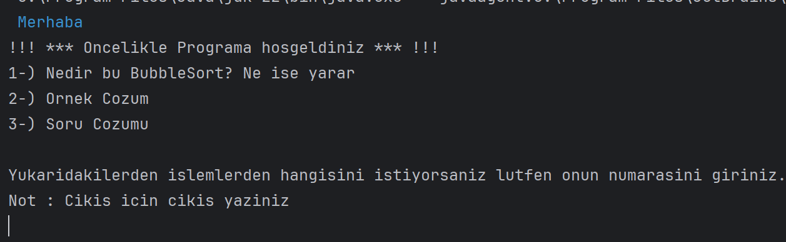

<h1><i>Bubble Sort Tutorial </i> </h1>

<h2>Content</h2>
<ul>
        <li><a href="#about-project">1-) About The Project</a></li>
        <li><a href="#why-project-created">2-) Why The Project Is Created?</a></li>
        <li><a href="#used-technologies">3-) Used Technologies </a></li>
        <!-- <li><a href="#images">4-) Images </a></li> -->
        <li><a href="#images">4-) Images </a>
                <ul> 
                        <li><a href="#intelij-idea-output">I-) Intelij IDEA Output</a></li>
                        <li><a href="#windows-cmd-output">II-) Docker Console Output</a></li>
                </ul>
        </li>
        <li><a href="#requirement">5-) Requirements</a></li>
         <li><a href="#quick-start">6-) Quick Start</a></li>
        <li><a href="#installation">7-) Installation</a></li>
        <li><a href="#docker">8-) Docker</a></li>
        
</ul>

<h2 id="about-project">1-) About The Project</h2>
The project is a bubble sort tutorial. It explains what bubble sort is, shows how to sort unsorted arrays, and helps the user sort arrays.
<br>

<h2 id="why-project-created">2-) Why The Project Is Created?</h2>
The project was created to learn and make any user learn how Bubble Sort works. The project was created in 2019. One of my first programs. So I did not want to change code or language. I just shared it as I did it.

<h2 id="used-technologies">3-) Used Technologies</h2>

  * JAVA SE
  

<h2 id="images">4-) Images </h2>

<h3 id="intelij-idea-output"><li> Intelij IDEA Output </li> </h3> 
<br>

</li> <br> <br>
</li> <br> <br>
</li> <br> <br>
</li> <br> <br>
</li> <br> <br>

<h3 id="windows-cmd-output"><li> Docker Console Output </li> </h3> 
<br>

</li> <br> <br>
</li> <br> <br>
</li> <br> <br>


<h2 id="requirement">5-) Requirements</h2>

* <a href="https://www.oracle.com/tr/java/technologies/javase/jdk11-archive-downloads.html">JDK 11</a>
* IDE (One of them is enough.)
  *  <a href="https://www.jetbrains.com/idea/download/?section=windows"> Intelij IDEA (Community Edition) </a>
  *  <a href="https://netbeans.apache.org/front/main/download/index.html">NetBeans IDE</a>

<h2 id="quick-start">6-) Quick Start</h2>
1-) Copy and paste the following command in your cmd.
<br><br>

```
git clone https://github.com/AhmetEminSaglik/BubbleSort.git
```
2-) Then copy and paste the following command in your cmd. (Colorful characters will be printed meaningless in CMD)
```
java -jar BubbleSort/BubbleSort.jar
```

<h2 id="installation">7-) Installation </h2>
1-) Copy and paste the following command in your cmd.
<br><br>

```
git clone https://github.com/AhmetEminSaglik/BubbleSort.git
```
2-) Open IDE, and open the cloned project.

3-) The project is ready to run.

<h2 id="docker">8-) Docker </h2>

1-) Copy and paste the following command in your cmd.
<br><br>
```
docker run --name bubble-sort-tutorial -it ahmeteminsaglik/bubble-sort:1.0
```


